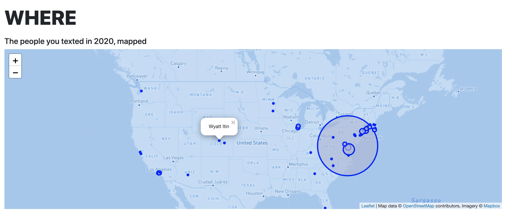

# iMessage Wrapped: Your 2020 as told by texts

#### Download link ↓↓

### Getting Started 
To run iMessageWrapped, you will need:

<ol>
<li>An OSX operating system</li>
<li>Your contacts and chat messages stored locally</li>
</ol>

iMessageWrapped does NOT store or even process your data remotely. All the work is done through your own local computer. 

After downloading the app, navigate to Security and Privacy and give iMessageWrapped Full Disk Accsess permission (if it does not appear in the list, click the + button and search for it manually). This will allow the app to analyze and compile your messages. 

Once you've done this, you can open the iMessageWrapped.exe file. If you get an `unidentified developer` error, try opening the app within finder by right clicking, and selecting `Open.` At this point, you may be prompted for access to your contacts, which you will also need to allow. 

A terminal will open, and after about 30 seconds, a browser window will open and begin to display your statistics for the year. 

<a href="https://github.com/michael-danello/iMessageWrappedRelease/archive/v1.0.zip" style="font-size:25px"> Download Here! </a>

In case these instructions don't work for you, DM me. Or, enjoy some screenshots from the page

### The Tech 

iMessageWrapped is build with Flask, Jinja, chart.js and leaflet. iMessages and Contacts live in a SQLite DB which the app queries directly. For parts of speech, the text is tokenized and tagged using nltk's averaged_perceptron_tagger. You can find the link to the full repo [here](https://github.com/michael-danello/iMessageWrapped)
